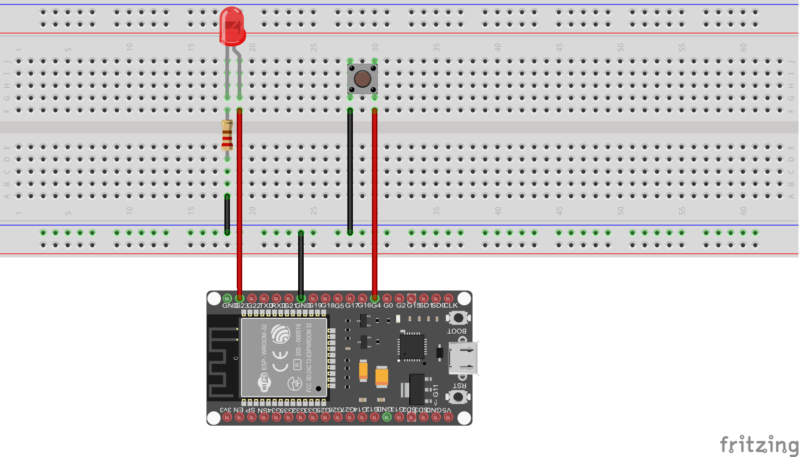

# Example: GPIO

This app demonstrates simple setup and usage of GPIO interrupts on the Espressif ESP32. Toggle LED with button press. 

## GPIO functions:

 * GPIO23: LED output
 * GPIO4:  input, pulled up, interrupt from falling edge

## Test:
 * Connect GPIO4 with button 
 * Connect GPIO23 with LED

 
